# Spotify recommender system
---
## Context and problem statement
Spotify is a digital music, podcast, and video service that gives you access to millions of songs and other content from creators all over the world. The platform has over 400 million monthly active users and has over 50 million tracks available. As an active daily user myself, I have always been fascinated on how spot on the platform is keeping me engaged, mostly thanks to their discovery feature which recommends songs a unique user might like. Because of this reason, I researched their API to see what type of data the platform allowed to be extracted. Once I found out there was a possibility to extract quite a range of metadata from songs such as musical features, I decided to try to develope a recommendation system myself where once inputed two songs of choice it recommends a playlist of 10 similar songs. This way if you are someone that listens to a wide variety of music, you can avoid being recommended a mixed genre playlist like Spotify sometimes does.

---
## Description of data
To achieve gathering a very genre rich dataset, track features have been manually extracted by calling different playlist in each of the following 13 genres. To do all the API calls, Spotipy is used, which is a lightweight Python library for the Spotify Web API.
- Country
- Pop
- Hip Hop
- R&B
- Jazz
- Blues
- Classical
- Latin
- Chill
- Workout
- Party
- Dance
- Disco

Next, I will describe the datasets gathered for this study. All the datasets share the following data dictionary:

| Feature          | Type   | Description                                                                                                                                                                                                                                  |
|------------------|--------|----------------------------------------------------------------------------------------------------------------------------------------------------------------------------------------------------------------------------------------------|
| id               | string | Spotify track id                                                                                                                                                                                                                             |
| title            | string | Track title                                                                                                                                                                                                                                  |
| all_artists      | string | Artist name                                                                                                                                                                                                                                  |
| popularity       | int    | Score of tracks popularity. Ranges from 0-100, 100 being the most popular.                                                                                                                                                                   |
| release_date     | string | Track release date.                                                                                                                                                                                                                          |
| danceability     | float  | Danceability describes how suitable a track is for dancing based on a combination of musical elements including tempo, rhythm stability, beat strength, and overall regularity. A value of 0.0 is least danceable and 1.0 is most danceable. |
| energy           | float  | Energy is a measure from 0.0 to 1.0 and represents a perceptual measure of intensity and activity.                                                                                                                                           |
| key              | int    | The key the track is in.                                                                                                                                                                                                                     |
| loudness         | float  | The overall loudness of a track in decibels (dB). Values typically range between -60 and 0 db.                                                                                                                                               |
| mode             | int    | Mode indicates the modality (major or minor) of a track, the type of scale from which its melodic content is derived. Major is represented by 1 and minor is 0.                                                                              |
| accousticness    | float  | A confidence measure from 0.0 to 1.0 of whether the track is acoustic. 1.0 represents high confidence the track is acoustic.                                                                                                                 |
| instrumentalness | float  | The closer the instrumentalness value is to 1.0, the greater likelihood the track contains no vocal content. Values above 0.5 are intended to represent instrumental tracks.                                                                 |
| liveness         | float  | Detects the presence of an audience in the recording. Higher liveness values represent an increased probability that the track was performed live.                                                                                           |
| valence          | float  | A measure from 0.0 to 1.0 describing the musical positiveness conveyed by a track.                                                                                                                                                           |
| tempo            | float  | The overall estimated tempo of a track in beats per minute (BPM).                                                                                                                                                                            |
| duration_ms      | int    | The duration of the track in milliseconds.                                                                                                                                                                                                   |
| time_signature   | int    | An estimated time signature. The time signature (meter) is a notational convention to specify how many beats are in each bar (or measure).                                                                                                   |

The individual datasets used to create one big single dataset of 31023 rows (each representing a song) and 17 columns (representing track features) named [`DATA.csv`](./data/DATA.csv) are the following:

- [`mix_1.csv`](./data/mix_1.csv): which contains 2094 rows and 17 columns.
- [`mix_2.csv`](./data/mix_2.csv): which contains 5370 rows and 17 columns.
- [`mix_3.csv`](./data/mix_3.csv): which contains 2158 rows and 17 columns.
- [`mix_4.csv`](./data/mix_4.csv): which contains 538 rows and 17 columns.
- [`mix_5.csv`](./data/mix_5.csv): which contains 795 rows and 17 columns.
- [`mix_6.csv`](./data/mix_6.csv): which contains 8310 rows and 17 columns.
- [`mix_7.csv`](./data/mix_7.csv): which contains 5742 rows and 17 columns.
- [`mix_8.csv`](./data/mix_8.csv): which contains 598 rows and 17 columns.
- [`mix_9.csv`](./data/mix_9.csv): which contains 780 rows and 17 columns.
- [`mix_10.csv`](./data/mix_10.csv): which contains 931 rows and 17 columns.
- [`mix_11.csv`](./data/mix_11.csv): which contains 1284 rows and 17 columns.
- [`mix_12.csv`](./data/mix_12.csv): which contains 1284 rows and 17 columns.
- [`mix_13.csv`](./data/mix_13.csv): which contains 1507 rows and 17 columns.
- [`mix_14.csv`](./data/mix_14.csv): which contains 200 rows and 17 columns.

---
## Data Analysis

1. **Data cleaning and feature engineering:**

Luckily, the metadata extracted from the Spotify API was pretty much almost ready to be worked on. These are some steps that I took to clean and feature engineer:
- Checked for missing values.
- Removed all rows with missing values.
- Checked and removed all duplicate tracks in the dataset.
- Created a column called 'release_year' where I only extracted the year of every value in the 'release_date'
- Removed the 'release_date' column
- Created a column called 'duration' where I transformed the duration in miliseconds to seconds
- Removed the 'duration_ms' column

2. **EDA and visualization:**

In this section, the data will be analyzed for an overview study of the data set and insight purposes.

The first thing that comes to mind when searching for insight and analyzing this type of data is some statistical summaries about each numerical feature. Below is a table that displays numerical values for some statistical insight about each feature in the dataset.

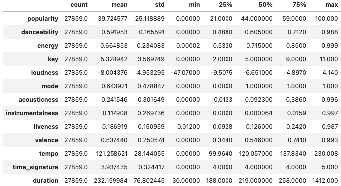

Here are some boxplots for a couple of features to make these statistical metrics more visual:

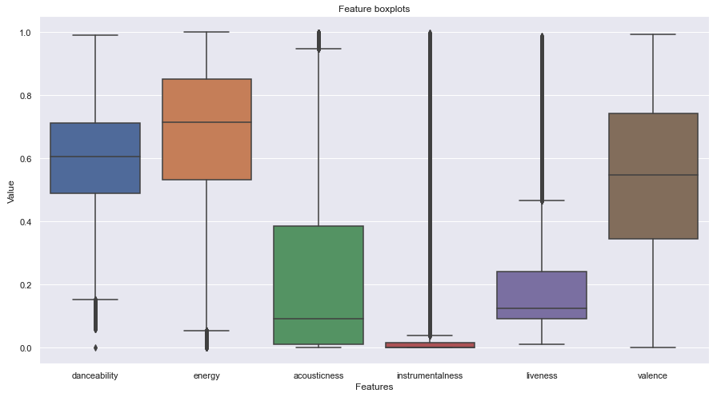

Some interesting insights extracted from these images are that the majority of features have a relative considerable standard deviation. This makes sense due to having a dataset comprised of various different genres, some of them being completely different as for audio features.

Because this dataset was manually constructed based on genres, it is important that it has a wide variety of artist. Artist usually don't change their style a lot and having a samll roaster could create bias and difficult cluster creation. [`DATA.csv`](./data/DATA.csv) dataset contains 13.560 unique artists (dataset contains 27859 unique tracks). Searching for some artist names based on their popularity, we find names such as Justin Bieber and Adele, which makes sense due to being pretty relevant nowadays. Below is a table of the top 10 artists who make for the most songs in the dataset, and as can be observed there is't one that makes for more than 0.5% of the dataset.

| Artist                | #   |
|-----------------------|-----|
| Arctic Monkeys        | 113 |
| Johnny Cash           | 62  |
| Taylor Swift          | 61  |
| The Strokes           | 49  |
| Kanye West            | 46  |
| Red Hot Chili Peppers | 45  |
| blink-182             | 45  |
| Cage The Elephant     | 45  |
| The Rolling Stones    | 45  |
| Eminem                | 43  |

Next, let's take a look at the correlation between audio features. These correlations make a lot of sense. One could have guessed that features like loudness and energy were coing to be very correlated, or that features like accousticness and energy were going to have a very negative correlation due to accoustic songs usually being more common in more laid-back genres.

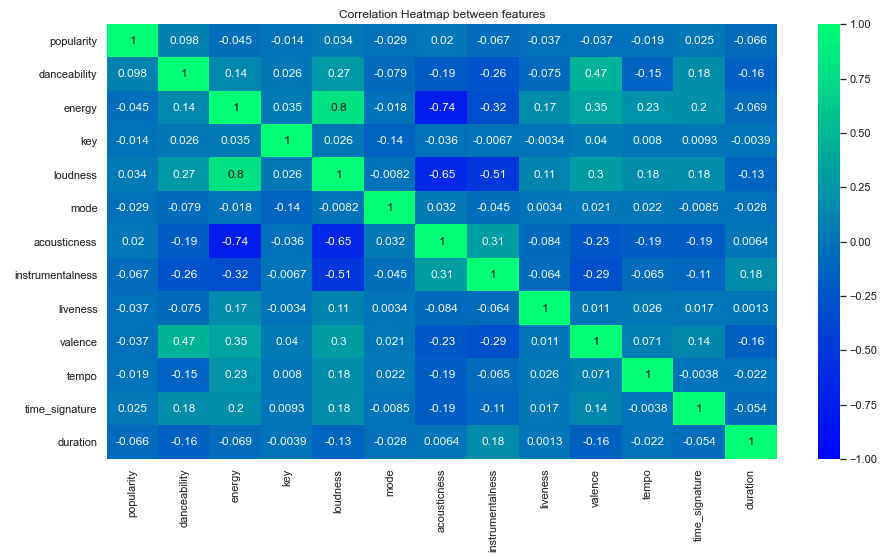

As shown below, song audio feature trends over the years have stabilized themselves compared to the earle 90's. This makes a lot of sense due to genres not changing that much ofer the years. Styles of music don't have that much of a range, they are very distinct types of music. If that was the case we would then be talking of a different genre.

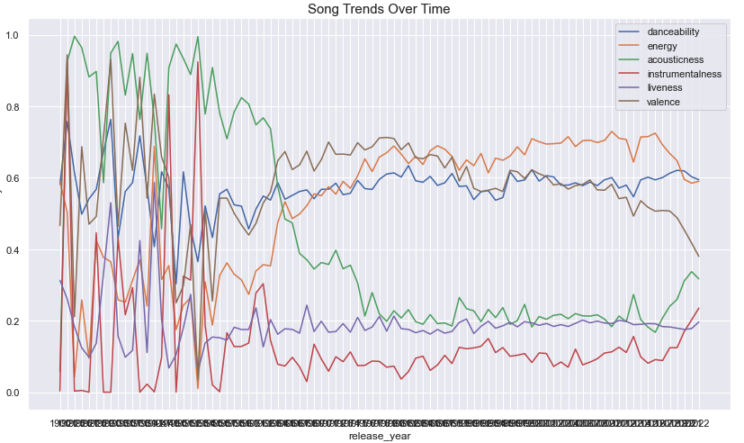

When plotting the same grapgh but for the duration of songs over the years, one interesting thing thas has happened in recent years, is that songs are shorter as the years progress. One could argue that this is because over the past years attention span is decreasing exponentially and artists take that into account. Or, maybe the dataset contains more of a specific genre which is characteristic for short songs for the latest years. Unfortunately this can't be studied due to the data not being labeled.

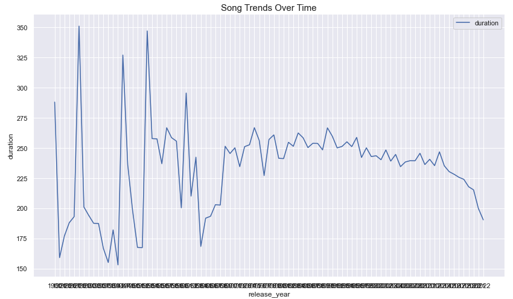

Moving on to some histograms that will show us how some features are distributed in the used dataset. 

First, the danceability feature. As seen, it is pretty normally distributed with a slight left skewe.

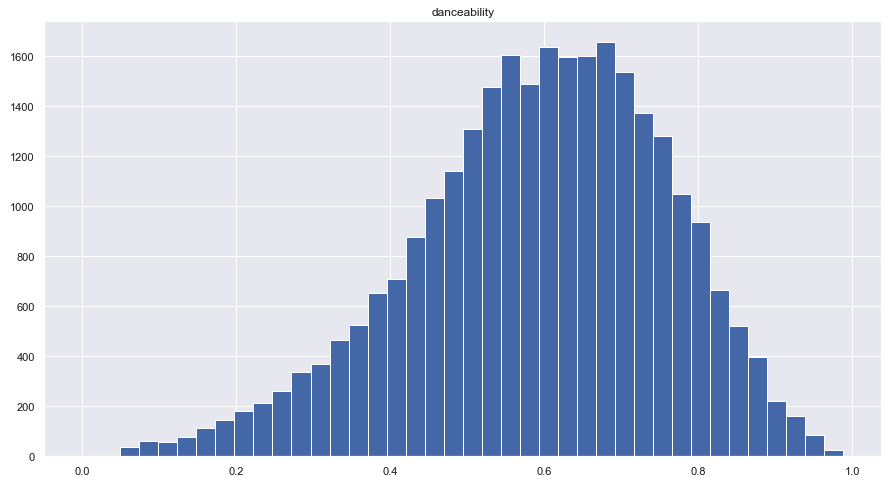

Then, there is the acousticness histogram, which shows a heavy concentration of data between 0 and 0.1. This indicates that the majority of the songs in the dataset aren't very accoustic.

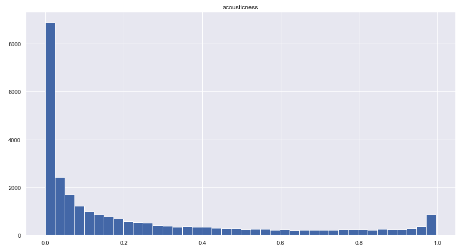

As for the instrumentalness, because the closer the value is to 1.0, the greater likelihood the track contains no vocal content. This makes total sense due to the majority of genres having at least a bit of vocal content.

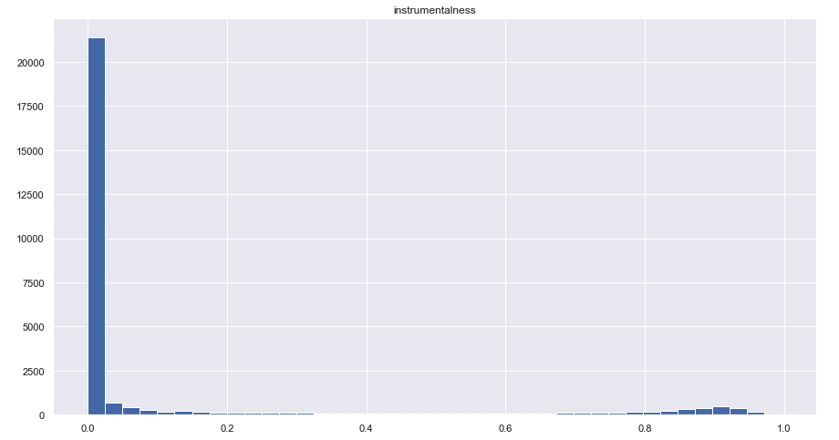

Last but not least, the valence feature. A measure from 0.0 to 1.0 describing the musical positiveness conveyed by a track. As observed, it is pretty equally distributed.

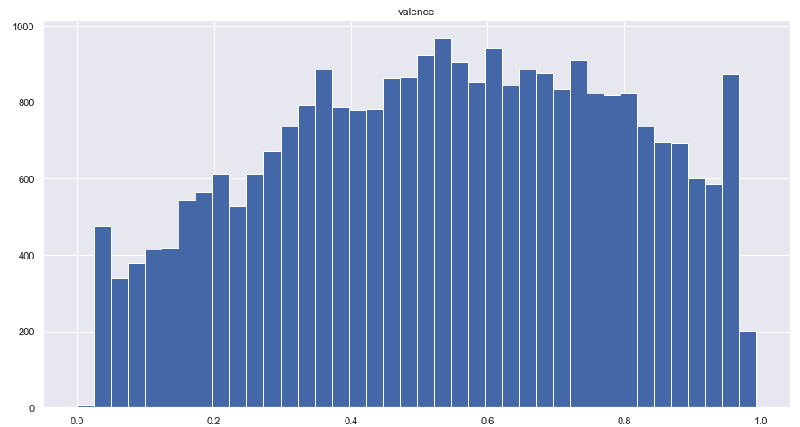

---
## Model development

Because the data I am working on isn't labeled I decided to go with an unsupervised approach where I am going to cluster the data and then predict the cluster for a a given list of 2 songs by the user and use that cluster only for recommendations.

Two different types of clustering algorithms were chosen that can be split in 2 groups: one group that don’t have a number of cluster as an input parameters (density models) and the other that uses a k number of clusters as input parameter (centroid based models).

- Density model: DBSCAN
- Centroid based model: KMeans

I am going to score the resulting clusters with 3 different metrics: Silhouette and Davis-Bouldin.
- The Silhouette ranges from −1 to +1, where a high value indicates that the object is well matched to its own cluster and poorly matched to neighboring clusters.
- The Davies-Bouldin index, is defined as the average similarity measure of each cluster with its most similar cluster, where similarity is the ratio of within-cluster distances to between-cluster distances. The minimum score is zero, with lower values indicating better clustering. The lower the average similarity is, the better the clusters are separated and the better is the result of the clustering performed.

**As always, the data is scaled before doing any processing**

### Data projection
For this data, TSNE (T-distributed Stochastic Neighbor Embedding) is used to project the data in a 2D space. This big blob is a 2D representation of all the songs in the data set.

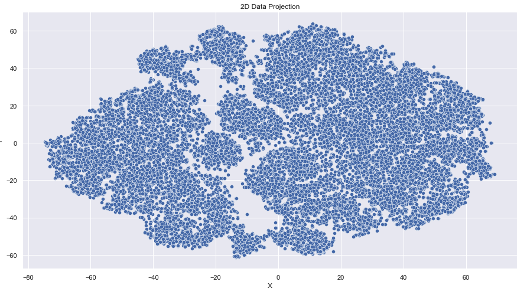

### Clustering and evaluation

#### DBSCAN
DBSCAN is a density-based clustering algorithm that forms clusters of dense regions of data points ignoring the low-density areas (considering them as noise).
###### Advantages
- Works well for noisy datasets.
- Can identity Outliers easily.
- Clusters can take any irregular shape unlike K-Means where clusters are more or less spherical.
###### Disadvantages
- Does not work very well for sparse datasets or datasets with varying density.
- Sensitive to eps parameter.
- Not partitionable for multiprocessor systems.

To decide which hyperparameters to use, I search for "eps" which is a value that deals with the radius of the clusters you are trying to find. We can find a suitable value for "eps" by calculating the distance to the nearest n points for each point, sorting and plotting the results. After, we look to see where the change is most pronounced and select that as epsilon.

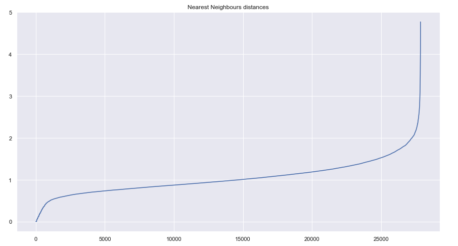

The change is most pronounced around 2, so let's examine the scores around eps=2. After numerically computating DBSCAN looking for the best "eps" value, the significant observation after this computation is that 2 is the optimal estimated number of clusters.

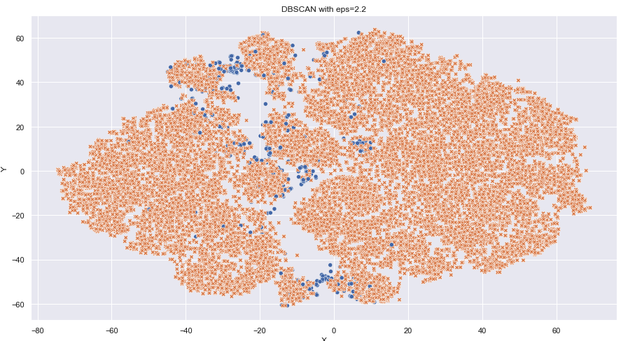

#### K-Means
K-Means cluster is one of the most commonly used unsupervised machine learning clustering techniques. It is a centroid based clustering technique that needs you decide the number of clusters (centroids) and randomly places the cluster centroids to begin the clustering process
###### Advantages
- Easy to understand and implement.
- Can handle large datasets well.\
###### Disadvantages
- Sensitive to number of clusters/centroids chosen.
- Does not work well with outliers.
- Gets slow as the number of dimensions increases.

Next, the evaluation metrics will be displayed. Prioritizing the quality of separation between clusters, as they represent types of similar songs, the Davies-Bouldin Index is going to be the final indicator for the k selection. From the computated results and the graphs above, it is clear that the optimal value of k for the K-Means algorithm is 10.

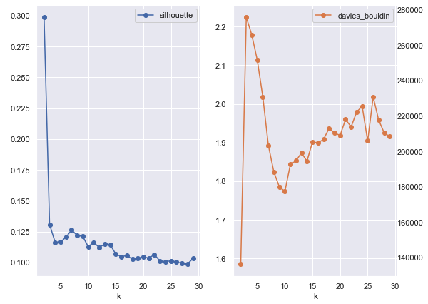

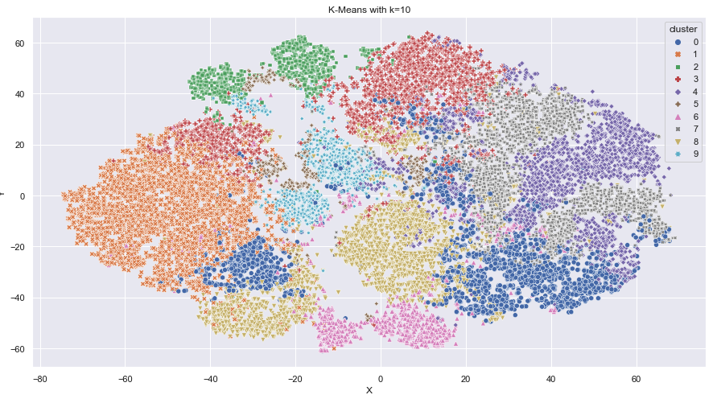

### Model selection
Prioritizing Davies-Bouldin Index as the indicator for our model selection, K-Means is the best model to create significant clusters. For the density model, the clustering hasn't worked as expected even after fine tuning the "eps" and the results weren't great either. 

Davies-Bouldin Scores:

- DBSCAN: 2.22
- KMeans: 1.77

### Recommender system
The music recommendation is going to be based on clustering. Each cluster has similar music in it and this is a key part of our recommender system because each cluster will serve as a boundary.By having a boundary, the risk of recommending music that it is unrelated is eliminated.

Once the user inputs two songs as seed songs for a playlist with similar songs, with our previously trained model, a target vector will be created calculating the feature means of those songs and it will be able to predict in which cluster the user is going to fall and recommend similar songs from that cluster.

The model will use the "cosine" similarity metric to recommend the top 10 most similar songs from the dataset. Cosine similarity is a metric used to measure similarity between two inputs. Mathematically, it measures the cosine of the angle between two vectors projected in a multi-dimensional space.

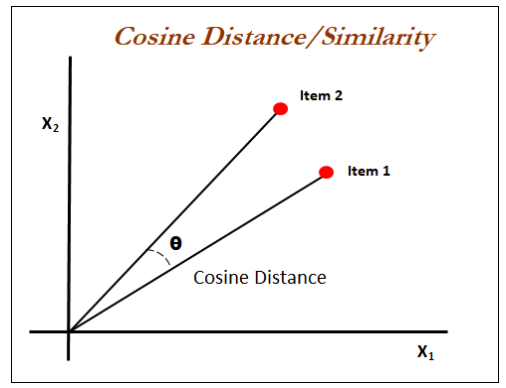

### Streamlit app
Because it would be a shame to have  ML models  die in a Jupyter Notebooks, models can be integrated into product/applications and available to any user. The complete deployment process involves three major steps.
- API which can easily access the machine learning models.
- Front-end application which will allow the users to access the predictions.
- Cloud/Server to deploy the application.
Next, is a peek to the simple and straightforward streamlit app built for this recommender system.

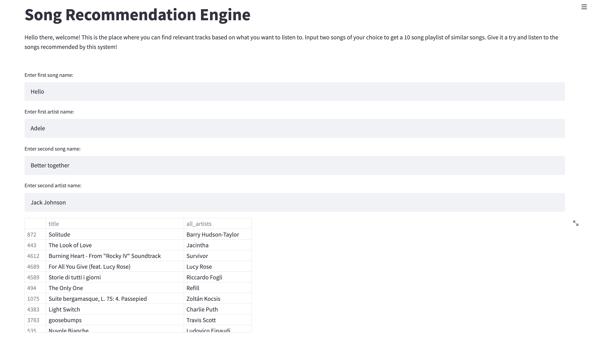

## Conclusion

Based on the results obtained after modeling, it can be seen, how K-Means is the best model to create clusters. This is supported by K-Means having the lowest Davies-Bouldin score. Also, the visualization is showing a better separation in clusters than the DBSCAN algorithm.

After developing this recommender system, I have found that recommendation systems can be much more complex. It is impossible to build some sort of recommender system similar to the one Spotify has developed without their data and insights on all their users. I can imagine they have some sort of hybrid recommender system that combines collaborative and content based filtering. 

